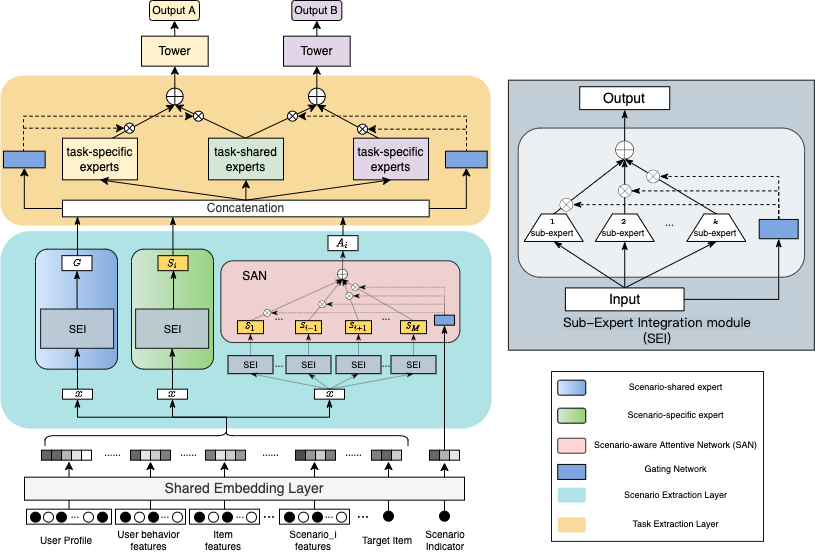

# Introduction
**H**ierarchical **i**nformation extraction **Net**work (HiNet)

Source code for paper: <font face=Times New Roman>HiNet: Novel Multi-Scenario & Multi-Task Learning with Hierarchical Information Extraction</font>

Model architecture:



Bibtex:
```sh
@article{Zhou2023HiNet,
  title={HiNet: Novel Multi-Scenario & Multi-Task Learning with Hierarchical Information Extraction},
  author={Zhou, Jie and Cao, Xianshuai and Li, Wenhao and Bo, Lin and Luo, Chuan and Yu, Qian},
  year={2023},
}
```

## Requirements
```
Python >= 3.7  
Tensorflow >= 1.15.0  
```

## Train and Evaluate Model

```
python -u HiNet.py --config_file_path=../config/hinet_sample_schemas.json --task_type=train
```
You can modify the "FLAGS" parameters as needed.

# Acknowledgement
 - The work is supported by [MeiTuan](https://www.meituan.com).
 - The work is also supported by the National Natural Science Foundation of China (No. 62202025 and 62002012).

# Model Gain Statistics
As of the latest time, HiNet model was deployed to several companies' business lines, and according to incomplete statistics, the business benefits of each company are as follows:

| Platform         | Gain                                                             |
|------------------|------------------------------------------------------------------|
 | Meituan catering | Relative order volume uplift of 1%-5% across multiple businesses. |
 | OPPO Advertising | 1% increase in CTR                                               |
| ...              | ...                                                              |